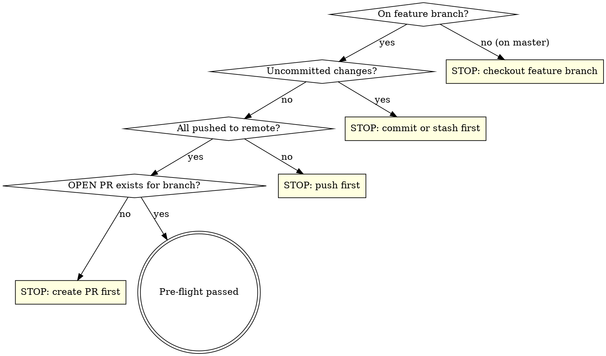

# CI/CD Pipeline Implementation Plan

> **For agentic workers:** REQUIRED SUB-SKILL: Use superpowers:subagent-driven-development (recommended) or superpowers:executing-plans to implement this plan task-by-task. Steps use checkbox (`- [ ]`) syntax for tracking.

**Goal:** Port the sibling plugin's portable CI + release workflow + deploy-plugin skill into `the-another-seo`, so lint/unit/e2e/plugin-check run identically in local Docker and native GitHub Actions, pushes to `master` auto-publish GitHub Releases, and `/deploy-plugin` preps releases on the PR branch.

**Architecture:** Shared, environment-agnostic shell scripts (`scripts/setup/*` install toolchain; `scripts/tests/*` run one suite each) are the single source of truth. Local dev calls them through Docker images (now `ubuntu:24.04`, matching the GH runner distro); CI calls them natively. `make` targets and both workflows are thin wrappers over the same scripts. Two workflows (`ci.yml` PR gate, `release.yml` push-to-master release) each inline the same four gate jobs.

**Tech Stack:** POSIX `sh`, Docker (`ubuntu:24.04`), GitHub Actions (`ubuntu-24.04`), PHP 8.3, Composer, Node ≥24, wp-cli, Playwright, WordPress.org Plugin Check.

## Global Constraints

- **PHP 8.3 only** — setup scripts hard-fail on any other series; workflows pin `runs-on: ubuntu-24.04` (not `-latest`); Docker base is `ubuntu:24.04`.
- **Node ≥ 24.**
- **Version pins live in setup scripts** as env-overridable defaults, nowhere else: `WP_VERSION=7.0`, `SQLITE_PLUGIN_VERSION=2.2.23`, `WP_CLI_SERVER_COMMAND_VERSION=v2.0.15`, `PCP_VERSION=2.0.0`, `DIST_ARCHIVE_COMMAND_VERSION=v3.1.0`.
- **Plugin slug:** `the-another-seo`. **Version constant:** `THE_ANOTHER_SEO_VERSION`. **Sandbox env var:** `THE_ANOTHER_SEO_CHROMIUM_NO_SANDBOX`. **Test-zip name:** `build/the-another-seo-test.zip`. **Release-zip name:** `build/the-another-seo-<version>.zip`. **Canonical repo URL:** `https://github.com/the-another/seo`.
- **Canonical /opt paths** (setup writes, provision scripts read): `/opt/wp-core`, `/opt/sqlite-database-integration`, `/opt/plugin-check.zip`.
- **Docker image names** (already in the Makefile, keep): `the-another-seo-runner:latest`, `the-another-seo-e2e-runner:latest`.
- Every git commit ends with: `Co-Authored-By: Claude Opus 4.8 (1M context) <noreply@anthropic.com>`.

---

## Stage 1 — Foundation: portable scripts, Ubuntu images, Makefile, sandbox flag

Deliverable: `make lint`, `make test`, `make test-e2e`, `make check-plugin`, and `npm run plugin-zip` all pass via new Ubuntu images running the shared scripts. One commit at the end of the stage.

### Task 1: Create the setup scripts (`scripts/setup/`)

**Files:**
- Create: `scripts/setup/unit.sh`
- Create: `scripts/setup/e2e.sh`

**Interfaces:**
- Produces: `scripts/setup/unit.sh` (installs PHP 8.3 CLI + ext, Composer, Node≥24, wp-cli + dist-archive-command; defines an `as_root` helper used only internally). `scripts/setup/e2e.sh` (sources `unit.sh`, adds sqlite/gd, provisions `/opt/wp-core`, `/opt/sqlite-database-integration`, `/opt/plugin-check.zip`, wp-cli server-command, `npm ci`, Playwright Chromium+ffmpeg). Both are idempotent and root/non-root aware.

- [ ] **Step 1: Write `scripts/setup/unit.sh`** (verbatim — this file is plugin-agnostic)

```sh
#!/bin/sh
# Toolchain for lint / unit tests / release-zip builds: PHP 8.3 CLI (+ the
# extensions the composer/phpcs/phpunit/wp-cli stack needs), Composer,
# Node >= 24, wp-cli + dist-archive-command.
#
# Runs IDENTICALLY in both environments that need this toolchain:
#   - tests/Unit/Dockerfile (ubuntu:24.04 base, as root) — the local `make` flow
#   - GitHub Actions ubuntu-24.04 runners (non-root, passwordless sudo)
# Idempotent: a present-and-adequate tool is left alone, so re-runs are cheap
# and the GH runner's preinstalled toolchain is reused where it fits.
#
# All version pins for this toolchain live HERE (env-overridable), not in
# any Dockerfile — the Dockerfiles just run this script.
set -e

# dist-archive-command v3.1.0: the newest release installable against
# wp-cli 2.12 (the latest wp-cli that exists) — 3.2.x declares wp-cli ^2.13,
# which has not been released. Revisit when wp-cli 2.13 ships.
DIST_ARCHIVE_COMMAND_VERSION="${DIST_ARCHIVE_COMMAND_VERSION:-v3.1.0}"

export DEBIAN_FRONTEND=noninteractive

# Root (Docker build) runs commands directly; non-root (GH runner) gets sudo.
as_root() {
	if [ "$(id -u)" = "0" ]; then
		"$@"
	else
		sudo "$@"
	fi
}

as_root apt-get update

# php8.3-* explicitly (not plain `php`): Ubuntu 24.04's native series is 8.3
# today, but pinning the package names makes a distro-default drift loud
# instead of silent. php8.3-xml covers dom/simplexml/xmlreader/xmlwriter.
as_root apt-get install -y --no-install-recommends \
	ca-certificates \
	curl \
	git \
	unzip \
	zip \
	php8.3-cli \
	php8.3-curl \
	php8.3-mbstring \
	php8.3-xml \
	php8.3-zip \
	php8.3-xdebug

# The plugin targets PHP 8.3; running the toolchain on any other series
# would silently lint/test against the wrong runtime. ubuntu-24.04 (runner
# label AND Docker base) is what guarantees this passes.
if ! php -v | head -n 1 | grep -q "PHP 8\.3\."; then
	echo "FATAL: PHP 8.3.x required, got: $(php -v | head -n 1)" >&2
	exit 1
fi

# Ubuntu auto-enables xdebug on install, which would slow every lint/test
# run. Disable it; `make coverage` loads it explicitly per invocation
# (php -dzend_extension=xdebug.so -dxdebug.mode=coverage).
as_root phpdismod -v 8.3 xdebug 2>/dev/null || true

if ! command -v composer >/dev/null 2>&1; then
	curl -sS https://getcomposer.org/installer -o /tmp/composer-setup.php
	as_root php /tmp/composer-setup.php --install-dir=/usr/local/bin --filename=composer
	rm -f /tmp/composer-setup.php
fi

# Node >= 24 (the version the aucteeno pipelines standardized on). The GH
# runner ships a current Node — leave it alone; the Docker base's apt Node
# is too old, so install from NodeSource there.
NODE_MAJOR="$(node -e 'console.log(process.versions.node.split(".")[0])' 2>/dev/null || echo 0)"
if [ "$NODE_MAJOR" -lt 24 ]; then
	curl -fsSL https://deb.nodesource.com/setup_24.x -o /tmp/nodesource-setup.sh
	as_root bash /tmp/nodesource-setup.sh
	rm -f /tmp/nodesource-setup.sh
	as_root apt-get install -y nodejs
fi

if ! command -v wp >/dev/null 2>&1; then
	curl -sSL https://raw.githubusercontent.com/wp-cli/builds/gh-pages/phar/wp-cli.phar -o /tmp/wp-cli.phar
	as_root install -m 0755 /tmp/wp-cli.phar /usr/local/bin/wp
	rm -f /tmp/wp-cli.phar
fi

if ! wp package list --format=csv --fields=name --allow-root 2>/dev/null | grep -q '^wp-cli/dist-archive-command$'; then
	wp package install "https://github.com/wp-cli/dist-archive-command/archive/refs/tags/${DIST_ARCHIVE_COMMAND_VERSION}.zip" --allow-root
fi

echo "setup/unit.sh: toolchain ready (php $(php -r 'echo PHP_VERSION;'), node $(node --version), composer $(composer --version --no-ansi 2>/dev/null | head -n 1))"
```

- [ ] **Step 2: Write `scripts/setup/e2e.sh`** (verbatim — plugin-agnostic; pins already match this repo)

```sh
#!/bin/sh
# Everything the two e2e suites (functional Playwright + Plugin Check) need,
# on top of the unit/lint toolchain: PHP sqlite/gd extensions, a
# version-pinned WordPress core at /opt/wp-core, the official SQLite drop-in
# at /opt/sqlite-database-integration, WordPress.org Plugin Check at
# /opt/plugin-check.zip, wp-cli's server-command, project npm deps, and
# Playwright's own Chromium + ffmpeg.
#
# Runs IDENTICALLY in tests/e2e/Dockerfile (root) and on GitHub Actions
# ubuntu-24.04 runners (non-root + sudo). The /opt paths are the contract
# tests/e2e/lib/provision-wp.sh and run-plugin-check.mjs rely on, in both
# environments. Idempotent: each /opt artifact is skipped if present
# (rm -rf it to force a re-provision after changing a pin outside Docker).
#
# Must run from a directory containing package.json (repo root, or the
# Dockerfile's /setup scratch dir): `npx playwright install` has to resolve
# the lockfile-pinned Playwright version.
set -e

# All e2e version pins live HERE (env-overridable), not in any Dockerfile.
WP_VERSION="${WP_VERSION:-7.0}"
SQLITE_PLUGIN_VERSION="${SQLITE_PLUGIN_VERSION:-2.2.23}"
# v2.0.15, not the newest tag: same constraint as dist-archive-command in
# setup/unit.sh — v2.0.16+ declare wp-cli ^2.13, which has not been released.
WP_CLI_SERVER_COMMAND_VERSION="${WP_CLI_SERVER_COMMAND_VERSION:-v2.0.15}"
PCP_VERSION="${PCP_VERSION:-2.0.0}"

SETUP_DIR="$(cd "$(dirname "$0")" && pwd)"

if [ ! -f package.json ]; then
	echo "FATAL: setup/e2e.sh must run from a directory containing package.json" >&2
	exit 1
fi

# Base toolchain first (defines as_root, runs apt-get update).
. "$SETUP_DIR/unit.sh"

# sqlite3 (covers pdo_sqlite too) for the SQLite drop-in; gd for WP image
# handling.
as_root apt-get install -y --no-install-recommends \
	php8.3-sqlite3 \
	php8.3-gd

# Version-pinned WordPress core, downloaded once to the canonical path.
# memory_limit=-1 defends against restrictive php.ini overrides — wp-cli's
# PharData extractor needs headroom for core's several thousand files.
if [ ! -d /opt/wp-core ]; then
	TMP_WP="$(mktemp -d)"
	php -d memory_limit=-1 "$(command -v wp)" core download \
		--version="$WP_VERSION" --path="$TMP_WP/wp-core" --allow-root
	as_root mv "$TMP_WP/wp-core" /opt/wp-core
	rmdir "$TMP_WP"
fi

if [ ! -d /opt/sqlite-database-integration ]; then
	curl -fsSL "https://downloads.wordpress.org/plugin/sqlite-database-integration.${SQLITE_PLUGIN_VERSION}.zip" \
		-o /tmp/sqlite.zip
	unzip -q /tmp/sqlite.zip -d /tmp/sqlite-extract
	as_root mv /tmp/sqlite-extract/sqlite-database-integration /opt/sqlite-database-integration
	rm -rf /tmp/sqlite.zip /tmp/sqlite-extract
fi

# WordPress.org Plugin Check, pinned — the check-plugin suite installs it
# from here instead of downloading at test time (reproducible runs; new
# upstream checks arrive via deliberate pin bumps).
if [ ! -f /opt/plugin-check.zip ]; then
	curl -fsSL "https://downloads.wordpress.org/plugin/plugin-check.${PCP_VERSION}.zip" \
		-o /tmp/plugin-check.zip
	as_root mv /tmp/plugin-check.zip /opt/plugin-check.zip
fi

if ! wp package list --format=csv --fields=name --allow-root 2>/dev/null | grep -q '^wp-cli/server-command$'; then
	wp package install "https://github.com/wp-cli/server-command/archive/refs/tags/${WP_CLI_SERVER_COMMAND_VERSION}.zip" --allow-root
fi

# Playwright's own (glibc) Chromium + ffmpeg, versioned by the lockfile.
# --with-deps installs the browser's system library dependencies via apt
# (Playwright uses sudo itself when not root). ffmpeg is listed explicitly:
# the functional suite records video ('on'), and `install chromium` alone
# does not fetch Playwright's ffmpeg build.
npm ci --no-audit --no-fund
npx playwright install --with-deps chromium ffmpeg

echo "setup/e2e.sh: e2e environment ready (wp-core $WP_VERSION at /opt/wp-core, sqlite drop-in $SQLITE_PLUGIN_VERSION, PCP $PCP_VERSION)"
```

- [ ] **Step 3: Syntax-check both scripts**

Run: `sh -n scripts/setup/unit.sh && sh -n scripts/setup/e2e.sh && echo OK`
Expected: `OK`

*(No commit yet — Stage 1 commits once at the end, after the images build and the gates pass.)*

### Task 2: Create the test scripts (`scripts/tests/`), remove `run-e2e.sh`

**Files:**
- Create: `scripts/tests/lint.sh`, `scripts/tests/unit.sh`, `scripts/tests/e2e.sh`, `scripts/tests/plugin-check.sh`
- Create: `scripts/tests/lib/build-test-zip.sh`
- Delete: `scripts/run-e2e.sh`

**Interfaces:**
- Consumes: the `/opt` artifacts + toolchain from Task 1's setup scripts.
- Produces: four suite runners, each `cd`-ing to repo root and self-bootstrapping composer deps. `lib/build-test-zip.sh` is **sourced** (not executed) by `e2e.sh`/`plugin-check.sh`; it rebuilds `build/the-another-seo-test.zip` fresh and asserts the block bundle is present.

- [ ] **Step 1: Write `scripts/tests/lint.sh`** (verbatim)

```sh
#!/bin/sh
# PHPCS lint (errors gate, warnings don't). Ensures dev composer deps itself:
# vendor/ may be missing (fresh CI checkout) or left in no-dev state by a
# zip build.
set -e

cd "$(dirname "$0")/../.."

if [ ! -x vendor/bin/phpcs ]; then
	composer install --no-interaction --no-progress
fi

composer phpcs
```

- [ ] **Step 2: Write `scripts/tests/unit.sh`** (verbatim)

```sh
#!/bin/sh
# PHPUnit unit suite. Clears the result cache first so stale ordering can
# never mask a failure. Ensures dev composer deps itself: vendor/ may be
# missing (fresh CI checkout) or left in no-dev state by a zip build.
set -e

cd "$(dirname "$0")/../.."

if [ ! -x vendor/bin/phpunit ]; then
	composer install --no-interaction --no-progress
fi

rm -rf .phpunit.cache
php ./vendor/bin/phpunit
```

- [ ] **Step 3: Write `scripts/tests/lib/build-test-zip.sh`** (ADAPTED: zip name + tripwire assets are this repo's `dist/breadcrumbs/`)

```sh
# Shared pre-flight for BOTH e2e suites (sourced by tests/e2e.sh and
# tests/plugin-check.sh — keeping it in exactly one file is what guarantees
# the functional suite and the Plugin Check suite can never drift).
#
# Both suites test the SAME packaged artifact: build the -test zip fresh
# every run (a stale zip would silently test old code). `composer build`
# inside this pipeline (install --no-dev + optimized autoload) is also what
# provides vendor/ on fresh CI checkouts — no separate vendor bootstrap.
# Side effect: a local vendor/ is left in no-dev state afterwards
# (`make install-dev` restores dev tooling for lint/test).
#
# Expects: CWD = repo root, `set -e` active in the sourcing script.

npm ci --no-audit --no-fund

rm -f build/the-another-seo-test.zip
npm run plugin-zip:check

# The breadcrumbs block loads its editor script from dist/breadcrumbs/ (see
# blocks/breadcrumbs/block.json). A packaging regression that stripped
# dist/ from the zip would leave the block silently unregisterable at
# runtime — no gate downstream reliably fails on it. Assert the built block
# bundle is present in the artifact both suites test, right after it is built.
ZIP="build/the-another-seo-test.zip"
for required in dist/breadcrumbs/index.js dist/breadcrumbs/index.asset.php; do
	if ! unzip -l "$ZIP" | grep -qF "$required"; then
		echo "FATAL: packaged zip is missing required block asset: $required" >&2
		exit 1
	fi
done
```

- [ ] **Step 4: Write `scripts/tests/e2e.sh`** (verbatim)

```sh
#!/bin/sh
# Functional e2e suite (native-PHP WordPress + Playwright). Environment
# prerequisites come from scripts/setup/e2e.sh (locally that's baked into
# the tests/e2e/Dockerfile image; on GitHub runners it runs as a workflow
# step). Referenced by `make test-e2e` and .github/workflows/*.yml alike.
set -e

cd "$(dirname "$0")/../.."

. scripts/tests/lib/build-test-zip.sh

npx playwright test --config tests/e2e/functional/playwright.config.ts
```

- [ ] **Step 5: Write `scripts/tests/plugin-check.sh`** (verbatim)

```sh
#!/bin/sh
# Plugin Check suite — no Playwright/browser: PCP runs via its WP-CLI
# runner (see tests/e2e/check-plugin/run-plugin-check.mjs). Environment
# prerequisites come from scripts/setup/e2e.sh. Referenced by
# `make check-plugin` and .github/workflows/*.yml alike.
set -e

cd "$(dirname "$0")/../.."

. scripts/tests/lib/build-test-zip.sh

node tests/e2e/check-plugin/run-plugin-check.mjs
```

- [ ] **Step 6: Delete the old shared runner**

Run: `git rm scripts/run-e2e.sh`
Expected: `rm 'scripts/run-e2e.sh'`

- [ ] **Step 7: Syntax-check all new scripts**

Run: `for f in scripts/tests/lint.sh scripts/tests/unit.sh scripts/tests/e2e.sh scripts/tests/plugin-check.sh scripts/tests/lib/build-test-zip.sh; do sh -n "$f" || exit 1; done && echo OK`
Expected: `OK`

### Task 3: Rewrite both Dockerfiles to `ubuntu:24.04` thin wrappers

**Files:**
- Modify (replace entire file): `tests/Unit/Dockerfile`
- Modify (replace entire file): `tests/e2e/Dockerfile`

**Interfaces:**
- Consumes: `scripts/setup/unit.sh` (Unit image), `scripts/setup/e2e.sh` (e2e image).
- Produces: `the-another-seo-runner:latest` and `the-another-seo-e2e-runner:latest`, the latter exporting `THE_ANOTHER_SEO_CHROMIUM_NO_SANDBOX=1`.

- [ ] **Step 1: Replace `tests/Unit/Dockerfile`**

```dockerfile
FROM ubuntu:24.04

# Same distro as the GitHub ubuntu-24.04 runners, so scripts/setup/unit.sh
# is the single toolchain definition for both environments (PHP 8.3 is
# Ubuntu 24.04's native series — the plugin's production target). All
# version pins live in the setup script, not here.
ENV DEBIAN_FRONTEND=noninteractive

COPY scripts/setup /setup/scripts/setup
RUN sh /setup/scripts/setup/unit.sh && rm -rf /var/lib/apt/lists/*

# The project directory is always bind-mounted to /app at run time, so the
# image deliberately contains no project files (a COPY here would only bloat
# the image and bust the cache on every source change).
WORKDIR /app

CMD ["sh"]
```

- [ ] **Step 2: Replace `tests/e2e/Dockerfile`** (ADAPTED env var name)

```dockerfile
FROM ubuntu:24.04

# Same distro as the GitHub ubuntu-24.04 runners, so scripts/setup/e2e.sh is
# the single environment definition for both the local `make` flow (this
# image) and CI's native jobs. All version pins (WP core, SQLite drop-in,
# Plugin Check, wp-cli packages) live in that script, not here.
ENV DEBIAN_FRONTEND=noninteractive

# package.json + package-lock.json only (not the source tree): the setup
# script needs them to `npm ci` and bake the lockfile-pinned Playwright
# Chromium + ffmpeg into /root/.cache/ms-playwright at build time. The
# scratch node_modules is discarded — the real one is created in the
# bind-mounted /app at run time — so this layer only busts when the
# lockfile or the setup scripts change.
COPY package.json package-lock.json /setup/
COPY scripts/setup /setup/scripts/setup
WORKDIR /setup
RUN sh scripts/setup/e2e.sh && rm -rf /setup/node_modules /var/lib/apt/lists/*

# Chromium refuses its sandbox as root, and this container runs as root.
# playwright.config.ts passes --no-sandbox exactly when this is set; host
# runs (macOS) and CI's non-root runner stay sandboxed.
ENV THE_ANOTHER_SEO_CHROMIUM_NO_SANDBOX=1

# The project directory is always bind-mounted to /app at run time.
WORKDIR /app

CMD ["sh"]
```

### Task 4: Switch the Playwright sandbox toggle to the new env var

**Files:**
- Modify: `tests/e2e/functional/playwright.config.ts:45-50`

**Interfaces:**
- Consumes: `THE_ANOTHER_SEO_CHROMIUM_NO_SANDBOX` from the e2e Docker image.
- Produces: no Alpine `executablePath` branch — Playwright's own Chromium is used everywhere; `--no-sandbox` only when the env var is set.

- [ ] **Step 1: Replace the `launchOptions` block**

Old (`tests/e2e/functional/playwright.config.ts`, lines 45-50):

```ts
		launchOptions: process.env.CHROMIUM_EXECUTABLE_PATH
			? {
					executablePath: process.env.CHROMIUM_EXECUTABLE_PATH,
					args: [ '--no-sandbox' ],
			  }
			: {},
```

New:

```ts
		// Playwright's own Chromium everywhere; --no-sandbox only where the
		// container runs it as root and sets THE_ANOTHER_SEO_CHROMIUM_NO_SANDBOX=1
		// (see tests/e2e/Dockerfile). Host runs and CI's non-root runner stay
		// sandboxed.
		launchOptions: process.env.THE_ANOTHER_SEO_CHROMIUM_NO_SANDBOX
			? { args: [ '--no-sandbox' ] }
			: {},
```

- [ ] **Step 2: Confirm no other reference to the old env var remains**

Run: `grep -rn "CHROMIUM_EXECUTABLE_PATH" tests/ scripts/ ; echo "exit=$?"`
Expected: no matches (grep prints nothing; `exit=1`).

### Task 5: Rewire the Makefile and update stale provision-script comments

**Files:**
- Modify: `Makefile` (recipes for `lint`, `test`, `test-e2e`, `check-plugin`; comment updates)
- Modify: `tests/e2e/lib/provision-wp.sh` (comment referencing "the image")
- Modify: `tests/e2e/check-plugin/provision-pcp-wp.sh` (comment referencing "baked")

**Interfaces:**
- Consumes: `scripts/tests/*.sh`.
- Produces: `make lint|test|test-e2e|check-plugin` delegating to the scripts; `docker-build`/`docker-build-e2e`/`release`/`version-*`/`coverage`/`install*` unchanged.

- [ ] **Step 1: Point `lint` at the script**

In `Makefile`, replace:

```make
lint: docker-build
	$(DOCKER_RUN) composer phpcs
```

with:

```make
lint: docker-build
	$(DOCKER_RUN) sh scripts/tests/lint.sh
```

- [ ] **Step 2: Point `test` at the script** (the cache-clear now lives in the script)

Replace:

```make
test: docker-build
	$(DOCKER_RUN) sh -c "rm -rf .phpunit.cache && php ./vendor/bin/phpunit"
```

with:

```make
test: docker-build
	$(DOCKER_RUN) sh scripts/tests/unit.sh
```

- [ ] **Step 3: Point `test-e2e` and `check-plugin` at the scripts**

Replace:

```make
test-e2e: docker-build-e2e
	$(DOCKER_RUN_E2E) sh scripts/run-e2e.sh functional
```

with:

```make
test-e2e: docker-build-e2e
	$(DOCKER_RUN_E2E) sh scripts/tests/e2e.sh
```

Replace:

```make
check-plugin: docker-build-e2e
	$(DOCKER_RUN_E2E) sh scripts/run-e2e.sh plugin-check
```

with:

```make
check-plugin: docker-build-e2e
	$(DOCKER_RUN_E2E) sh scripts/tests/plugin-check.sh
```

- [ ] **Step 4: Refresh the two multi-line comments that still describe `scripts/run-e2e.sh`**

Above `test-e2e`, replace the comment block that says *"Both this target and check-plugin below call the same shared script — see scripts/run-e2e.sh."* with:

```make
# Run the functional native-PHP + Playwright suite inside Docker. This
# target and check-plugin below share their zip-build pre-flight via
# scripts/tests/lib/build-test-zip.sh (sourced by both suite scripts), so
# the two suites can never drift from what CI runs.
```

Above `check-plugin`, update the trailing sentence *"Entirely inside Docker via the same shared script as test-e2e."* to *"Entirely inside Docker via scripts/tests/plugin-check.sh, which shares its zip-build pre-flight with test-e2e."*

- [ ] **Step 5: Update the two provision-script comments that name image-baked artifacts**

In `tests/e2e/lib/provision-wp.sh`, change the comment *"image: baked core at /opt/wp-core, SQLite drop-in at /opt/sqlite-database-integration."* to reference the setup script:

```sh
# scripts/setup/e2e.sh provisions these to the canonical /opt paths in both
# environments (baked into the Docker image locally; a workflow step in CI):
# WP core at /opt/wp-core, SQLite drop-in at /opt/sqlite-database-integration.
```

In `tests/e2e/check-plugin/provision-pcp-wp.sh`, change *"Check (baked, pinned — /opt/plugin-check.zip)"* to *"Check (provisioned by scripts/setup/e2e.sh, pinned — /opt/plugin-check.zip)"*.

- [ ] **Step 6: Grep for any lingering `run-e2e.sh` reference**

Run: `grep -rn "run-e2e" Makefile scripts tests docs 2>/dev/null ; echo "exit=$?"`
Expected: no matches (`exit=1`).

### Task 6: Verify the whole foundation, then commit

- [ ] **Step 1: Build both images from scratch**

Run: `make docker-build && make docker-build-e2e`
Expected: both image builds finish without error; the final layers echo `setup/unit.sh: toolchain ready ...` and `setup/e2e.sh: e2e environment ready ...`.

- [ ] **Step 2: Run the lint + unit gates**

Run: `make lint && make test`
Expected: PHPCS reports no errors; PHPUnit prints `OK` (all tests pass, same count as before the port).

- [ ] **Step 3: Run both e2e suites (Playwright Chromium, not Alpine's)**

Run: `make test-e2e && make check-plugin`
Expected: functional Playwright suite all green; Plugin Check reports 0 errors. The build-test-zip tripwire prints nothing (assets present).

- [ ] **Step 4: Confirm the release zip still builds and excludes dev docs later added in Stage 3**

Run: `make install-dev && npm run plugin-zip && unzip -l build/the-another-seo-*.zip | grep -E "dist/breadcrumbs/index.(js|asset.php)"`
Expected: both `dist/breadcrumbs/index.js` and `dist/breadcrumbs/index.asset.php` are listed inside the zip.

- [ ] **Step 5: Commit Stage 1**

```bash
git add scripts/ tests/Unit/Dockerfile tests/e2e/Dockerfile tests/e2e/functional/playwright.config.ts tests/e2e/lib/provision-wp.sh tests/e2e/check-plugin/provision-pcp-wp.sh Makefile
git commit -m "ci: portable setup/test scripts on ubuntu base images

Replace the Docker/make-only e2e flow with shared scripts/setup/* and
scripts/tests/* that run identically in Docker and native CI. Move both
Docker bases Alpine 3.24 -> ubuntu:24.04, delete the musl-Chromium/ffmpeg/
memory_limit workarounds, and switch the Playwright sandbox toggle to
THE_ANOTHER_SEO_CHROMIUM_NO_SANDBOX. scripts/run-e2e.sh is removed; its
logic moves to scripts/tests/lib/build-test-zip.sh.

Co-Authored-By: Claude Opus 4.8 (1M context) <noreply@anthropic.com>"
```

---

## Stage 2 — CI workflow: `ci.yml` replaces `e2e.yml`

Deliverable: a four-job PR gate running the shared scripts natively. One commit.

### Task 7: Add `ci.yml`, remove `e2e.yml`

**Files:**
- Create: `.github/workflows/ci.yml`
- Delete: `.github/workflows/e2e.yml`

**Interfaces:**
- Consumes: `scripts/setup/{unit,e2e}.sh`, `scripts/tests/{lint,unit,e2e,plugin-check}.sh`.
- Produces: four required checks — `PHPCS`, `PHPUnit`, `Functional E2E`, `Plugin Check (PCP)`.

- [ ] **Step 1: Write `.github/workflows/ci.yml`**

```yaml
name: CI

# PR gate. All four jobs run the same scripts/setup/* + scripts/tests/*
# scripts the local Docker flow uses — no make, no Docker in CI (see
# docs/superpowers/specs/2026-07-04-cicd-pipeline-design.md).
# ubuntu-24.04 pinned (not -latest): PHP 8.3 is that image's native series,
# and scripts/setup/unit.sh hard-fails on any other PHP.

on:
  pull_request:
    branches:
      - master
      - main
      - 'release/**'
      # Stacked PRs (feature branch based on another feature branch) gate too.
      - 'feature/**'
  workflow_dispatch:

permissions:
  contents: read

jobs:
  lint:
    name: PHPCS
    runs-on: ubuntu-24.04
    steps:
      - name: Checkout code
        uses: actions/checkout@v4

      - name: Set up toolchain
        run: sh scripts/setup/unit.sh

      - name: Run PHPCS
        run: sh scripts/tests/lint.sh

  unit:
    name: PHPUnit
    runs-on: ubuntu-24.04
    steps:
      - name: Checkout code
        uses: actions/checkout@v4

      - name: Set up toolchain
        run: sh scripts/setup/unit.sh

      - name: Run PHPUnit
        run: sh scripts/tests/unit.sh

  test-e2e:
    name: Functional E2E
    runs-on: ubuntu-24.04
    steps:
      - name: Checkout code
        uses: actions/checkout@v4

      - name: Set up e2e environment
        run: sh scripts/setup/e2e.sh

      - name: Run functional e2e suite
        run: sh scripts/tests/e2e.sh

      - name: Upload Playwright report on failure
        if: failure()
        uses: actions/upload-artifact@v4
        with:
          name: playwright-report-functional
          path: |
            playwright-report/
            test-results/
          retention-days: 7

  # Runs Plugin Check natively via wp-cli (no browser, no Playwright) —
  # all checks, including the 5 runtime ones. See the check-plugin suite's
  # early-init canary in tests/e2e/check-plugin/run-plugin-check.mjs.
  check-plugin:
    name: Plugin Check (PCP)
    runs-on: ubuntu-24.04
    steps:
      - name: Checkout code
        uses: actions/checkout@v4

      - name: Set up e2e environment
        run: sh scripts/setup/e2e.sh

      - name: Run Plugin Check suite
        run: sh scripts/tests/plugin-check.sh

      - name: Upload Plugin Check results on failure
        if: failure()
        uses: actions/upload-artifact@v4
        with:
          name: plugin-check-results
          path: build/plugin-check-results.txt
          retention-days: 7
```

- [ ] **Step 2: Delete the old workflow**

Run: `git rm .github/workflows/e2e.yml`
Expected: `rm '.github/workflows/e2e.yml'`

- [ ] **Step 3: Validate the YAML parses**

Run: `node -e "require('js-yaml')" 2>/dev/null && node -e "const y=require('js-yaml');y.load(require('fs').readFileSync('.github/workflows/ci.yml','utf8'));console.log('ci.yml OK')" || python3 -c "import yaml,sys; yaml.safe_load(open('.github/workflows/ci.yml')); print('ci.yml OK')"`
Expected: `ci.yml OK`

- [ ] **Step 4: Commit Stage 2**

```bash
git add .github/workflows/ci.yml
git commit -m "ci: replace e2e.yml with four-job native ci.yml

PRs now gate on PHPCS, PHPUnit, Functional E2E, and Plugin Check running
scripts/setup/* + scripts/tests/* natively on ubuntu-24.04 (no Docker/make
in CI). Adds lint+unit CI coverage the repo never had. Branch protection
required-check names must be updated once after merge.

Co-Authored-By: Claude Opus 4.8 (1M context) <noreply@anthropic.com>"
```

---

## Stage 3 — Release workflow, repo-URL fix, and supporting docs

Deliverable: `release.yml` publishing GitHub Releases on push to master; a working `CHANGELOG.md` promotion; `README.md`/`CONTRIBUTORS.md` present and excluded from the zip. One commit.

### Task 8: Fix the CHANGELOG repo URL in `version-bump.js`

**Files:**
- Modify: `scripts/version-bump.js:108`

**Interfaces:**
- Produces: CHANGELOG compare links pointing at the real origin `the-another/seo`.

- [ ] **Step 1: Correct the `repo` constant**

In `scripts/version-bump.js`, replace:

```js
  const repo = 'https://github.com/theanother/the-another-seo';
```

with:

```js
  const repo = 'https://github.com/the-another/seo';
```

- [ ] **Step 2: Confirm the change and that no other file hardcodes the wrong URL**

Run: `grep -rn "theanother/the-another-seo" scripts docs 2>/dev/null ; echo "exit=$?"`
Expected: no matches (`exit=1`).

### Task 9: Create `CHANGELOG.md` (activates the dormant promotion block)

**Files:**
- Create: `CHANGELOG.md`

**Interfaces:**
- Consumes: nothing.
- Produces: a `## [Unreleased]` section (required by `version-bump.js`'s promotion) + a `[0.1.0]` entry + compare links using the corrected repo URL.

- [ ] **Step 1: Write `CHANGELOG.md`**

```markdown
# Changelog

All notable changes to The Another SEO are documented here.

The format is based on [Keep a Changelog](https://keepachangelog.com/en/1.1.0/), and this project adheres to [Semantic Versioning](https://semver.org/spec/v2.0.0.html).

> How releases are cut: add notes under **[Unreleased]** as you work. Running `make version-patch|version-minor|version-major` promotes the `[Unreleased]` section here into a dated release entry, opens a fresh empty `[Unreleased]`, and retargets the comparison links below. (It separately appends a `* Version bump` stub to [`readme.txt`](readme.txt), the WordPress.org listing — replace that stub with the same notes when curating a release.)

## [Unreleased]

### Added
- Developer documentation: `README.md`, `CONTRIBUTORS.md`, and this `CHANGELOG.md`.
- Portable CI/CD pipeline: shared `scripts/setup/*` (toolchain) and `scripts/tests/*` (one suite each) shell scripts that run identically inside the local Docker images (now `ubuntu:24.04`-based) and natively on GitHub's `ubuntu-24.04` runners; a four-job PR gate (`.github/workflows/ci.yml` — PHPCS, PHPUnit, Functional E2E, Plugin Check); and a GitHub release pipeline (`.github/workflows/release.yml`) that, on every push to `master`, re-runs the full gate, builds the release zip, tags `v<version>` from `package.json`, and publishes a GitHub Release.
- `/deploy-plugin` project skill: preps a versioned release on the PR branch (full local gate, version bump, changelog curation, lock-file validation, push, CI monitoring).

### Changed
- Both Docker base images moved Alpine 3.24 → `ubuntu:24.04`; the musl-Chromium, ffmpeg-symlink, and `memory_limit` workarounds are removed in favour of Playwright's own Chromium. The Playwright sandbox toggle is now `THE_ANOTHER_SEO_CHROMIUM_NO_SANDBOX`.

## [0.1.0] - 2026-07-02

### Added
- Initial release.
- Indexable content table built at catalog scale, with templated titles and meta descriptions.
- Open Graph and Twitter Card meta output.
- Schema.org JSON-LD structured data.
- Breadcrumbs block.
- Chunked static XML sitemaps.

[Unreleased]: https://github.com/the-another/seo/compare/v0.1.0...HEAD
[0.1.0]: https://github.com/the-another/seo/releases/tag/v0.1.0
```

### Task 10: Create `README.md` (plugin-facing) and `CONTRIBUTORS.md` (dev guide)

**Files:**
- Create: `README.md`
- Create: `CONTRIBUTORS.md`

**Interfaces:**
- Produces: two dev docs, both excluded from the shipped zip in Task 12.

- [ ] **Step 1: Write `README.md`**

```markdown
# The Another SEO

A WordPress SEO plugin for large catalogs. It builds an indexable content
table at catalog scale and layers on the on-page SEO surface WordPress core
leaves out.

## Features

- **Indexable table** — a normalized index of indexable content, built and
  maintained at catalog scale so title/meta resolution stays fast.
- **Templated titles & meta descriptions** — token-templated per content type.
- **Open Graph & Twitter Cards** — social meta tags on every public URL.
- **Schema.org JSON-LD** — structured data output for search engines.
- **Breadcrumbs block** — a native block for theme templates.
- **Chunked static sitemaps** — XML sitemaps split into bounded chunks.

## Requirements

- WordPress 6.9+
- PHP 8.3+

## License

GPL-2.0-or-later.

## Homepage

https://github.com/the-another/seo

---

- The WordPress.org listing text lives in [`readme.txt`](readme.txt).
- Development setup, architecture, and commands are in [`CONTRIBUTORS.md`](CONTRIBUTORS.md).
- Release history is in [`CHANGELOG.md`](CHANGELOG.md).
```

- [ ] **Step 2: Write `CONTRIBUTORS.md`** (the `includes/` list below must match the actual directory — verify in Step 3)

```markdown
# Contributing

Development guide for The Another SEO. The user-facing description is in
[`README.md`](README.md); release history is in [`CHANGELOG.md`](CHANGELOG.md).

## Maintainers

| Handle       | Role        |
| ------------ | ----------- |
| theanother   | Maintainer  |
| ziontrooper  | Maintainer  |

(Mirrors the `Contributors:` header in [`readme.txt`](readme.txt).)

## Architecture

The plugin bootstraps through a small core in `includes/`:

- **Container.php / HookManager.php / Plugin.php** — DI container, hook
  registration, and the top-level plugin lifecycle.
- **Installer.php** — activation/install lifecycle.
- **Blocks.php** — block registration (registers `blocks/breadcrumbs`, built to
  `dist/breadcrumbs/`).

Domain code is grouped by responsibility under `includes/`:

- **Admin** — settings screens and admin UI.
- **Breadcrumbs** — the breadcrumbs block's server-side logic.
- **Database** — the indexable table schema and access.
- **Indexable** — building and maintaining the indexable content index.
- **Meta** — templated titles and meta descriptions.
- **Schema** — Schema.org JSON-LD output.
- **Settings** — persisted plugin settings.
- **Sitemap** — chunked static XML sitemap generation.
- **Social** — Open Graph and Twitter Card meta output.

## Toolchain

Everything runs in Docker via `make`; CI runs the same
`scripts/setup/*` + `scripts/tests/*` scripts natively.

| Command             | What it does                                                    |
| ------------------- | --------------------------------------------------------------- |
| `make install-dev`  | Install composer deps incl. dev (in Docker).                    |
| `make lint`         | PHPCS (`scripts/tests/lint.sh`).                                |
| `make format`       | PHPCBF — **modifies source**.                                   |
| `make test`         | PHPUnit (`scripts/tests/unit.sh`).                              |
| `make coverage`     | PHPUnit with xdebug coverage.                                   |
| `make test-e2e`     | Functional Playwright suite (`scripts/tests/e2e.sh`).           |
| `make check-plugin` | WordPress.org Plugin Check (`scripts/tests/plugin-check.sh`).   |
| `make all`          | install-dev + lint + test.                                      |
| `make release`      | Build the distributable zip into `build/`.                      |
| `make version-patch` / `version-minor` / `version-major` | Bump version + promote `CHANGELOG.md` (no commit). |
| `make clean`        | Remove vendor/, node_modules/, caches, build output.            |

## Releasing

Use the `/deploy-plugin` skill on an open PR branch: it runs the full gate,
bumps the version, curates `CHANGELOG.md` + `readme.txt` from the PR, pushes,
and monitors CI. Merging the PR to `master` triggers
`.github/workflows/release.yml`, which re-gates, builds the zip, tags
`v<version>`, and publishes the GitHub Release.
```

- [ ] **Step 3: Verify the architecture list matches the real `includes/` tree**

Run: `ls includes/`
Expected: the directories named in `CONTRIBUTORS.md` (Admin, Blocks, Database, Indexable, Meta, Schema, Settings, Sitemap, Social + the Container/HookManager/Plugin core files) exist. If a name differs, correct `CONTRIBUTORS.md` to match the actual directory before committing.

### Task 11: Add the release workflow

**Files:**
- Create: `.github/workflows/release.yml`

**Interfaces:**
- Consumes: the same scripts as `ci.yml`; `package.json` version; `npm run plugin-zip` → `build/the-another-seo-<version>.zip`.
- Produces: a tag `v<version>` and a GitHub Release with the zip attached.

- [ ] **Step 1: Write `.github/workflows/release.yml`**

```yaml
name: Release Plugin

# On every push to master: re-run the FULL gate (lint, unit, functional
# e2e, Plugin Check — same scripts as ci.yml), then build the release zip,
# tag v<version> (from package.json), and publish a GitHub Release with the
# zip attached. Pushing without a version bump is a no-op release: the
# existing-tag check skips the release steps with a warning.

on:
  push:
    branches: [master]
  workflow_dispatch:

permissions:
  contents: write

jobs:
  lint:
    name: PHPCS
    runs-on: ubuntu-24.04
    steps:
      - name: Checkout code
        uses: actions/checkout@v4

      - name: Set up toolchain
        run: sh scripts/setup/unit.sh

      - name: Run PHPCS
        run: sh scripts/tests/lint.sh

  unit:
    name: PHPUnit
    runs-on: ubuntu-24.04
    steps:
      - name: Checkout code
        uses: actions/checkout@v4

      - name: Set up toolchain
        run: sh scripts/setup/unit.sh

      - name: Run PHPUnit
        run: sh scripts/tests/unit.sh

  test-e2e:
    name: Functional E2E
    runs-on: ubuntu-24.04
    steps:
      - name: Checkout code
        uses: actions/checkout@v4

      - name: Set up e2e environment
        run: sh scripts/setup/e2e.sh

      - name: Run functional e2e suite
        run: sh scripts/tests/e2e.sh

      - name: Upload Playwright report on failure
        if: failure()
        uses: actions/upload-artifact@v4
        with:
          name: playwright-report-functional
          path: |
            playwright-report/
            test-results/
          retention-days: 7

  check-plugin:
    name: Plugin Check (PCP)
    runs-on: ubuntu-24.04
    steps:
      - name: Checkout code
        uses: actions/checkout@v4

      - name: Set up e2e environment
        run: sh scripts/setup/e2e.sh

      - name: Run Plugin Check suite
        run: sh scripts/tests/plugin-check.sh

      - name: Upload Plugin Check results on failure
        if: failure()
        uses: actions/upload-artifact@v4
        with:
          name: plugin-check-results
          path: build/plugin-check-results.txt
          retention-days: 7

  release:
    name: Build & Release
    runs-on: ubuntu-24.04
    needs: [lint, unit, test-e2e, check-plugin]

    steps:
      - name: Checkout code
        uses: actions/checkout@v4

      - name: Read version from package.json
        id: version
        run: |
          VERSION=$(node -p "require('./package.json').version")
          echo "version=$VERSION" >> $GITHUB_OUTPUT
          echo "tag=v$VERSION" >> $GITHUB_OUTPUT
          echo "Version: $VERSION"

      - name: Check if tag already exists
        id: tag_check
        run: |
          TAG="v${{ steps.version.outputs.version }}"
          if git ls-remote --tags origin "$TAG" | grep -q "$TAG"; then
            echo "exists=true" >> $GITHUB_OUTPUT
            echo "::warning::Tag $TAG already exists — skipping release."
          else
            echo "exists=false" >> $GITHUB_OUTPUT
          fi

      - name: Set up toolchain
        if: steps.tag_check.outputs.exists == 'false'
        run: sh scripts/setup/unit.sh

      - name: Build release zip
        if: steps.tag_check.outputs.exists == 'false'
        run: |
          npm ci --no-audit --no-fund
          npm run plugin-zip

      - name: Create and push tag
        if: steps.tag_check.outputs.exists == 'false'
        run: |
          TAG="${{ steps.version.outputs.tag }}"
          git tag "$TAG"
          git push origin "$TAG"

      - name: Create GitHub Release
        if: steps.tag_check.outputs.exists == 'false'
        uses: softprops/action-gh-release@v2
        with:
          tag_name: ${{ steps.version.outputs.tag }}
          generate_release_notes: true
          files: build/the-another-seo-${{ steps.version.outputs.version }}.zip
```

- [ ] **Step 2: Validate the YAML parses**

Run: `node -e "const y=require('js-yaml');y.load(require('fs').readFileSync('.github/workflows/release.yml','utf8'));console.log('release.yml OK')" 2>/dev/null || python3 -c "import yaml; yaml.safe_load(open('.github/workflows/release.yml')); print('release.yml OK')"`
Expected: `release.yml OK`

### Task 12: Exclude the dev docs from the zip

**Files:**
- Modify: `.distignore`

**Interfaces:**
- Produces: `README.md`, `CONTRIBUTORS.md`, `CHANGELOG.md` never ship in the release zip.

- [ ] **Step 1: Add the three docs to `.distignore`**

Under the "Source control / project metadata" section of `.distignore`, add:

```
# Developer docs — readme.txt is the shipped user doc
/README.md
/CONTRIBUTORS.md
/CHANGELOG.md
```

### Task 13: Verify Stage 3 end-to-end, then commit

- [ ] **Step 1: Prove the CHANGELOG promotion block activates (scratch bump, then revert)**

Run: `make version-patch 2>&1 | grep -F "Updated CHANGELOG.md"`
Expected: `✓ Updated CHANGELOG.md` is printed.

Then revert the scratch bump:

Run: `git checkout -- package.json composer.json the-another-seo.php readme.txt CHANGELOG.md package-lock.json composer.lock`
Expected: working tree clean for those files (`git status --porcelain` shows none of them).

- [ ] **Step 2: Prove the dev docs are excluded from the zip**

Run: `npm run plugin-zip && unzip -l build/the-another-seo-*.zip | grep -E "README.md|CONTRIBUTORS.md|CHANGELOG.md" ; echo "exit=$?"`
Expected: no matches (`exit=1`) — none of the three docs are in the zip.

- [ ] **Step 3: Restore dev vendor (the zip build left it no-dev)**

Run: `make install-dev`
Expected: composer installs dev dependencies without error.

- [ ] **Step 4: Commit Stage 3**

```bash
git add .github/workflows/release.yml scripts/version-bump.js README.md CONTRIBUTORS.md CHANGELOG.md .distignore
git commit -m "ci: add release workflow, changelog, and supporting docs

release.yml re-gates and publishes a GitHub Release (tag v<version>, zip
attached) on every push to master. Adds README.md, CONTRIBUTORS.md, and
CHANGELOG.md (activating the previously-dormant version-bump.js promotion
block), excludes all three from the shipped zip, and fixes the CHANGELOG
compare-link repo URL to the real origin (the-another/seo).

Co-Authored-By: Claude Opus 4.8 (1M context) <noreply@anthropic.com>"
```

---

## Stage 4 — deploy-plugin skill

Deliverable: `.claude/skills/deploy-plugin/SKILL.md` adapted to the new CI. One commit.

### Task 14: Add the deploy-plugin skill

**Files:**
- Create: `.claude/skills/deploy-plugin/SKILL.md`

**Interfaces:**
- Consumes: `make` targets (Stage 1), `ci.yml` (Stage 2), `release.yml` + `CHANGELOG.md` (Stage 3).
- Produces: an invocable `/deploy-plugin` skill.

Notes for the implementer:
- The supersede note on `docs/superpowers/specs/2026-07-04-deploy-plugin-skill-design.md` is **already committed** (in the design-spec commit) — do not re-add it.
- Step 0 ordering is deliberate: run the two e2e targets first, then `make all` **last**, because both e2e targets leave `vendor/` in no-dev state and `make all` (install-dev + lint + unit) restores dev deps before the lint/unit gates.
- Base branch is `master`; the workflow to monitor in Step 7 is **CI** (`ci.yml`, four jobs).

- [ ] **Step 1: Write `.claude/skills/deploy-plugin/SKILL.md`**

````markdown
---
name: deploy-plugin
description: Use when preparing a plugin release — runs the full Docker quality gate, bumps version, curates both changelogs from the PR, validates lock files, commits, pushes, and monitors CI
disable-model-invocation: true
argument-hint: "[patch|minor|major]"
---

# Deploy Plugin

Prepare and deploy a versioned release of The Another SEO.

## Step 0: Quality Gate

Run the full quality suite **before** anything else. All must pass to proceed.
The order is load-bearing: both e2e targets run `composer build` inside their
zip pipeline and leave `vendor/` in no-dev state, so `make all` (install-dev +
lint + unit test) must come **last** — it restores dev dependencies before the
lint/test gates. The block bundle needs no separate build step here: the zip
pipeline inside both e2e runs executes `npm run build`, and
`scripts/tests/lib/build-test-zip.sh`'s tripwire fails the run loudly if the
built block bundle is missing from the packaged zip.

```bash
make test-e2e       # functional Playwright suite (Docker)
make check-plugin   # WordPress.org Plugin Check vs the packaged zip (Docker)
make all            # install-dev + lint + unit tests (Docker)
```

If any fail, **stop immediately**. Report the exact error and ask:

> **Quality gate failed.** `<target>` reported errors:
>
> ```
> <error output>
> ```
>
> Should I attempt to fix this?

Wait for the user's answer. If they say yes, attempt the fix, re-run the
failing check, and restart this step from the top. If the fix doesn't work,
stop — do not proceed to pre-flight.

## Pre-flight Checks

After the quality gate passes, verify the branch is clean and ready:



Run these checks:

```bash
# A remote must exist
git remote -v              # should be non-empty

# Must not be on master
git branch --show-current  # should NOT be "master"

# No uncommitted changes
git status --porcelain     # should be empty

# All pushed
git log @{u}..HEAD --oneline  # should be empty

# PR exists and is OPEN
gh pr view --json number,title,state -q '.state'   # must be "OPEN"
```

If any check fails, **stop and tell the user** what needs to be done. Do not
proceed. If the PR is merged or closed, the branch cannot proceed — the CI
workflow (`.github/workflows/ci.yml`) triggers only on pull_request, so pushing
to a branch without an open PR runs no CI and Step 7 would read a stale green
run. This skill never creates the PR itself.

## Step 1: Ask Version Type

Read the current version from `package.json`.

If the version type was passed as a skill argument (patch / minor / major),
confirm it briefly:

> Releasing a **<type>** version bump — current version `<version from package.json>`.

If the supplied argument is not exactly patch, minor, or major, do not guess —
fall through to asking.

Otherwise, ask the user:

> What type of release? **(patch / minor / major)**
>
> Current version: `<version from package.json>`

If asking, wait for their answer. Do not assume.

## Step 2: Bump Version

```bash
make version-<type>
```

This runs in Docker and updates: `package.json`, `composer.json`, the plugin
header + `THE_ANOTHER_SEO_VERSION` constant in `the-another-seo.php`,
`readme.txt` (stable tag + a `* Version bump` changelog stub), **promotes
`CHANGELOG.md`'s `[Unreleased]` section into a dated release entry**, and syncs
both lock files. It commits nothing — review happens in the next steps and the
commit lands in Step 6.

## Step 3: Update Changelogs (two files)

1. Fetch the release's source material:
   ```bash
   gh pr view --json body -q '.body'
   gh pr view --json title -q '.title'
   git log origin/master..HEAD --oneline
   ```

2. `readme.txt`: replace the `* Version bump` stub with a real changelog entry
   in WordPress readme format:
   ```
   = X.Y.Z - YYYY-MM-DD =
   * Fix: ...
   * Add: ...
   * Refactor: ...
   ```
   Each line starts with a category prefix: `Fix:`, `Add:`, `Refactor:`,
   `Docs:`, `Chore:`. Use the PR summary bullets, the commit messages, and the
   just-promoted `CHANGELOG.md` entry as source material.

3. `CHANGELOG.md`: verify the promoted `## [X.Y.Z] - YYYY-MM-DD` entry is
   accurate and non-empty (its content normally accumulated under
   `[Unreleased]` during development). If the promotion produced an empty or
   stale section, write it from the same sources in Keep-a-Changelog style.

## Step 4: Validate Lock Files

```bash
# Check npm lock file is up to date
npm install --package-lock-only
# Check composer lock file is up to date
composer validate --no-check-all
```

If either fails, fix the issue before proceeding.

## Step 5: Re-verify (lint + unit only — deliberately)

```bash
make lint
make test
```

The bump touched version markers and changelog text only, so the e2e suites
are **not** re-run here — Step 0 already gated them against this exact code.
Do not "harden" this step by adding the e2e targets back; that doubles a
long gate for zero coverage. If lint or tests fail, attempt to fix the issue
(one attempt). If the fix doesn't work, stop and tell the user.

## Step 6: Commit and Push

```bash
git add -A
git commit -m "chore: bump version to X.Y.Z, update changelog"
git push
```

## Step 7: Monitor CI

After pushing, monitor the **CI** workflow (`.github/workflows/ci.yml` — four
jobs: PHPCS, PHPUnit, Functional E2E, Plugin Check (PCP)):

```bash
# Wait a moment for CI to pick up the push, then watch
gh run list --branch <branch> --limit 1 --json databaseId,status,conclusion,headSha
```

Poll the CI run status (use `/loop` or periodic checks). Only treat the run as
authoritative once its `headSha` equals `git rev-parse HEAD`; if the latest run
is for an older commit, keep waiting — a pre-push run's green is not this
release's green. Report outcome:

- **CI passes**: Tell the user the release is ready and the PR can be merged.
  Note that merging to `master` triggers `.github/workflows/release.yml`, which
  re-gates, builds the zip, tags `v<version>`, and publishes the GitHub Release
  automatically — this skill's scope ends at "PR is green and mergeable".
- **CI fails**: Fetch the failed job logs, identify the error, attempt one fix,
  commit, push, and re-monitor. If the second attempt also fails, stop and
  show the user the error.

```bash
# Get failed run details
gh run view <run-id> --log-failed
```
````

- [ ] **Step 2: Confirm the skill is discoverable and every referenced command/name is real**

Run: `test -f .claude/skills/deploy-plugin/SKILL.md && grep -q "name: deploy-plugin" .claude/skills/deploy-plugin/SKILL.md && grep -qE "THE_ANOTHER_SEO_VERSION" .claude/skills/deploy-plugin/SKILL.md && grep -qE "version-patch|version-minor|version-major" Makefile && grep -q "name: CI" .github/workflows/ci.yml && echo OK`
Expected: `OK`

- [ ] **Step 3: Confirm no stale MBGS tokens leaked into the skill**

Run: `grep -rniE "multi-brand|mbgs|global-styles|Fable" .claude/skills/deploy-plugin/SKILL.md ; echo "exit=$?"`
Expected: no matches (`exit=1`).

- [ ] **Step 4: Commit Stage 4**

```bash
git add .claude/skills/deploy-plugin/SKILL.md
git commit -m "feat: add /deploy-plugin release-prep skill

Ported from the sibling plugin and adapted to this repo's new CI: master
base branch, full local make gate, and Step 7 monitoring ci.yml's four
jobs. Notes that merge to master auto-triggers release.yml.

Co-Authored-By: Claude Opus 4.8 (1M context) <noreply@anthropic.com>"
```

---

## Final verification (whole branch)

- [ ] **Step 1: Full local gate green from a clean state**

Run: `make clean && make all && make test-e2e && make check-plugin`
Expected: install-dev + PHPCS + PHPUnit all pass; both e2e suites green; Plugin Check 0 errors.

- [ ] **Step 2: Push the branch and open the PR to exercise `ci.yml` natively**

```bash
git push -u origin ci-cd-pipeline
gh pr create --base master --title "CI/CD pipeline: portable CI + release workflow + deploy-plugin skill" --body "See docs/superpowers/specs/2026-07-04-cicd-pipeline-design.md"
```
Expected: the PR's four checks (PHPCS, PHPUnit, Functional E2E, Plugin Check (PCP)) all pass — the first real test of native-CI provisioning portability.

- [ ] **Step 3: Post-merge follow-up (out of band)**

After merge, update branch-protection required-check names (the two old `e2e.yml` job names are replaced by the four `ci.yml` names), and confirm the first push to `master` either skips `release.yml` on the existing-tag check or, on a version bump, publishes `v<version>` with the zip attached.

---

## Self-Review

**Spec coverage:** Component A (portable scripts) → Tasks 1-2; Component B (Ubuntu Dockerfiles + sandbox) → Tasks 3-4; Component C (Makefile) → Task 5; Component D (ci.yml) → Task 7; Component E (release.yml) → Task 11; Component F (docs + repo-URL fix) → Tasks 8-10, 12; Component G (deploy skill) → Task 14; supersede note → already committed in the spec commit. All spec sections mapped.

**Type/name consistency:** `THE_ANOTHER_SEO_CHROMIUM_NO_SANDBOX` used identically in the e2e Dockerfile (Task 3) and playwright.config.ts (Task 4). Zip names (`the-another-seo-test.zip` in Task 2; `the-another-seo-<version>.zip` in Task 11) match `package.json`'s `plugin-zip`. Repo URL `the-another/seo` used in Tasks 8 and 9. Script paths referenced in the Makefile (Task 5), ci.yml (Task 7), and release.yml (Task 11) all match the files created in Tasks 1-2.

**Placeholder scan:** every code step contains full file contents or exact find/replace blocks; verification steps give concrete commands and expected output. The one prose-authored area (Task 10 `CONTRIBUTORS.md` architecture list) has an explicit Step 3 that verifies the list against the real `includes/` tree and corrects it before commit.
