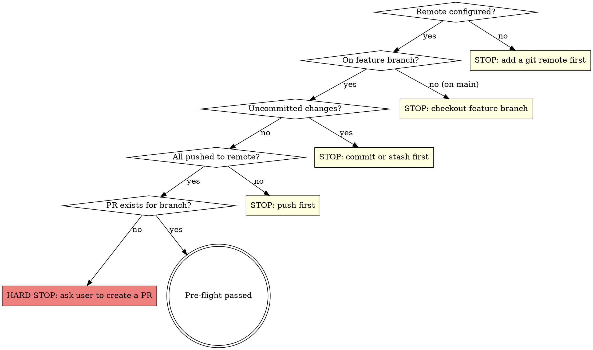

# Deploy-Plugin Skill Port Implementation Plan

> **For agentic workers:** REQUIRED SUB-SKILL: Use superpowers:subagent-driven-development (recommended) or superpowers:executing-plans to implement this plan task-by-task. Steps use checkbox (`- [ ]`) syntax for tracking.

**Goal:** Port aucteeno's `/deploy-plugin` release-prep skill into this repo (adapted to the dockerised Make toolchain) and add the three supporting docs it depends on (README.md, CONTRIBUTORS.md, CHANGELOG.md).

**Architecture:** Two deliverables. First the supporting docs — three new markdown files modeled on `../the-another-multi-brand-global-styles`' counterparts, with `.distignore` keeping them out of the release zip; creating CHANGELOG.md activates the dormant promotion block in `scripts/version-bump.js`. Then the skill itself — `.claude/skills/deploy-plugin/SKILL.md`, a step-for-step adaptation of `../aucteeno/.claude/skills/deploy-plugin/SKILL.md` (dockerised gates, `main` base, hard-stop on missing PR, CHANGELOG-curation-before-bump), plus a `.gitignore` narrowing so the skill directory is trackable.

**Tech Stack:** Markdown only (a Claude Code skill file + three docs); verification via the existing dockerised Make targets.

**Approved spec:** `docs/superpowers/specs/2026-07-04-deploy-plugin-skill-design.md`

## Global Constraints

- Source skill (copy FROM, never modify): `../aucteeno/.claude/skills/deploy-plugin/SKILL.md`; doc models: `../the-another-multi-brand-global-styles/{README,CONTRIBUTORS,CHANGELOG}.md`
- Plugin facts: slug `the-another-seo`, main file `the-another-seo.php`, constant `THE_ANOTHER_SEO_VERSION`, current version `0.1.0`, WP ≥ 6.9, PHP ≥ 8.3, default branch `main`, contributors `theanother`/`ziontrooper`, repo URL constant in scripts/version-bump.js: `https://github.com/theanother/the-another-seo`
- CI workflow name: `E2E and Plugin Check` (`.github/workflows/e2e.yml`, jobs: `Functional E2E`, `Plugin Check (PCP)`)
- README.md / CONTRIBUTORS.md / CHANGELOG.md are dev docs: excluded via `.distignore`, never in the release zip (readme.txt is the shipped doc)
- CHANGELOG.md must satisfy scripts/version-bump.js's regexes: a `## [Unreleased]` heading and an `[Unreleased]: <url>` link line
- Skill flow ordering: CHANGELOG.md `[Unreleased]` curation happens BEFORE `make version-<type>` (the bump promotes it); readme.txt placeholder replacement happens AFTER
- The skill never creates a PR — missing PR is a hard stop asking the user
- Commits end with `Co-Authored-By: Claude Fable 5 <noreply@anthropic.com>`

---

### Task 1: Supporting docs (README.md, CONTRIBUTORS.md, CHANGELOG.md) + .distignore

**Files:**
- Create: `README.md`, `CONTRIBUTORS.md`, `CHANGELOG.md`
- Modify: `.distignore` (add three exclusions)

**Interfaces:**
- Produces: `CHANGELOG.md` with `## [Unreleased]` section and `[Unreleased]:` link line (consumed by `scripts/version-bump.js` and by Task 2's skill Step 2); README/CONTRIBUTORS referenced by the skill and each other via relative links.

- [ ] **Step 1: Create README.md**

Exact content:

```markdown
# The Another SEO

Performance-first SEO for WordPress at **catalog scale** — an indexable table with one row per public post, page, or term serves titles, meta tags, and sitemaps without computing them on every request.

- **Requires:** WordPress 6.9+, PHP 8.3+
- **License:** GPL-2.0-or-later
- **Homepage:** <https://theanother.org/plugin/seo/>

> For the WordPress.org listing, see [`readme.txt`](readme.txt). For development setup, architecture, testing, and how to contribute, see [`CONTRIBUTORS.md`](CONTRIBUTORS.md). Release history is in [`CHANGELOG.md`](CHANGELOG.md).

## What it does

- **Template-driven titles and descriptions** — per-post-type templates with tokens like `%%title%%`, `%%excerpt%%`, `%%sep%%`, and `%%sitename%%`, with per-post overrides in the editor metabox.
- **Open Graph and Twitter Cards** — social tags on every managed page; WooCommerce products upgrade `og:type` to `product` with price and availability.
- **Schema.org JSON-LD** — a connected graph (Organization, WebSite, WebPage, Article, Product, BreadcrumbList) emitted as a single `application/ld+json` block.
- **Breadcrumbs** — a `the-another/seo-breadcrumbs` block plus a PHP template tag, backed by Schema.org BreadcrumbList markup.
- **Sitemaps at catalog scale** — chunked XML sitemap files written to `wp-content/uploads/taseo-sitemaps/` and served statically, with a live root index at `/sitemap.xml`; core's `/wp-sitemap.xml` is disabled while the plugin serves its own tree.
- **Background indexing** — the initial backfill runs in Action Scheduler batches, so activation stays instant even on sites with millions of objects.

## License

GPL-2.0-or-later. See [`readme.txt`](readme.txt) for the full license notice.
```

- [ ] **Step 2: Create CONTRIBUTORS.md**

Exact content:

````markdown
# Contributors

The Another SEO is maintained by The Another and the people listed below.

The WordPress.org contributor usernames are mirrored in the `Contributors:` header of [`readme.txt`](readme.txt).

## Maintainers

| Name / handle | WordPress.org | Role |
| --- | --- | --- |
| The Another | [`theanother`](https://profiles.wordpress.org/theanother/) | Author / maintainer |
| ziontrooper | [`ziontrooper`](https://profiles.wordpress.org/ziontrooper/) | Contributor |

## Contact

- Website: <https://theanother.org>
- Email: <hello@theanother.org>
- Plugin homepage: <https://theanother.org/plugin/seo/>

## Architecture

Container-based dependency injection (`Container` singleton + `HookManager`), with code organized by domain, not technical layer:

```
includes/
├── Container.php            # DI container (lazy factories, singletons)
├── HookManager.php          # tracked add_action/add_filter registration
├── Plugin.php               # orchestrator — hook wiring, activation-deferred backfill/flush
├── Installer.php            # activation: tables + deferred-work flags
├── Blocks.php               # block registration (blocks/breadcrumbs)
├── Admin/                   # settings page (options-general.php?page=taseo) + editor metabox
├── Breadcrumbs/             # trail builder + renderer (nav.taseo-breadcrumbs)
├── Database/                # wp_taseo_indexables + wp_taseo_sitemap_files schemas
├── Indexable/               # the indexable table: repository, save/delete sync, AS backfill
├── Meta/                    # <title>, meta description, canonical, robots (wp_head prio 1)
├── Schema/                  # JSON-LD graph builder + output (wp_head prio 3)
├── Settings/                # typed access over the taseo_settings option
├── Sitemap/                 # chunk assignment, file writer, sweeper (AS), server (rewrites)
└── Social/                  # Open Graph + Twitter Cards (wp_head prio 2)
```

The block editor source lives in `blocks/breadcrumbs/` (block.json + render.php + JS), built by `@wordpress/scripts` into `dist/breadcrumbs/` — both ship in the release zip, along with runtime `vendor/` (Action Scheduler).

## Development

Everything runs inside Docker via `make` — no host PHP/Node needed. Docker images build automatically on first use.

| Command | What it does |
| --- | --- |
| `make install-dev` | composer install incl. dev tooling |
| `make lint` / `make format` | PHPCS check / PHPCBF auto-fix |
| `make test` | PHPUnit unit suite (`tests/Unit/`) |
| `make coverage` | PHPUnit with xdebug coverage → `build/coverage/` |
| `make test-e2e` | Playwright functional suite against the packaged `-test` zip (`tests/e2e/functional/`) |
| `make check-plugin` | WordPress.org Plugin Check against the packaged `-test` zip (`tests/e2e/check-plugin/`) |
| `make release` | lint + test gates, then build `build/the-another-seo-<version>.zip` |
| `make version-patch\|minor\|major` | bump version everywhere + promote `CHANGELOG.md` `[Unreleased]` |
| `make all` | install-dev + lint + test |
| `make clean` | remove vendor/, node_modules/, build/, dist/, caches |

Note: `make test-e2e` / `make check-plugin` leave `vendor/` in no-dev state (their zip build runs `composer install --no-dev`); run `make install-dev` afterwards to restore lint/test tooling.

## Contributing

1. Branch from `main`; keep `main` releasable.
2. Before opening a PR: `make all`, `make test-e2e`, and `make check-plugin` must all pass.
3. Add release notes for your change under `## [Unreleased]` in [`CHANGELOG.md`](CHANGELOG.md) (Keep a Changelog headings: `### Added` / `### Changed` / `### Fixed`).
4. Releases are cut with the `/deploy-plugin` skill (see `.claude/skills/deploy-plugin/`), which gates on the full test suite and curates the changelog from the PR.
````

- [ ] **Step 3: Create CHANGELOG.md**

Exact content (the `## [Unreleased]` heading and the `[Unreleased]:` link line are load-bearing — `scripts/version-bump.js` matches both with regexes):

```markdown
# Changelog

All notable changes to The Another SEO are documented here.

The format is based on [Keep a Changelog](https://keepachangelog.com/en/1.1.0/), and this project adheres to [Semantic Versioning](https://semver.org/spec/v2.0.0.html).

> How releases are cut: add notes under **[Unreleased]** as you work. Running `make version-patch|version-minor|version-major` promotes the `[Unreleased]` section here into a dated release entry, opens a fresh empty `[Unreleased]`, and retargets the comparison links below. (It separately appends a `* Version bump` stub to [`readme.txt`](readme.txt), the WordPress.org listing — replace that stub with the same notes when curating a release.)

## [Unreleased]

### Added
- Developer documentation: `README.md`, `CONTRIBUTORS.md`, and this `CHANGELOG.md`.
- `/deploy-plugin` release-prep skill (`.claude/skills/deploy-plugin/`): full dockerised quality gate, version bump, changelog curation from the PR, push, and CI monitoring.
- Dockerised test/build toolchain: a `Makefile` covering lint/test/coverage/e2e/release/version targets across two Alpine php83 images; PHPUnit suite regrouped under `tests/Unit/`.
- End-to-end test infrastructure: a native-PHP (+ official SQLite drop-in) Playwright functional suite (`tests/e2e/functional/` — activation, meta/social tags, Schema JSON-LD, breadcrumbs, sitemaps) and a WP-CLI-runner WordPress.org Plugin Check suite (`tests/e2e/check-plugin/`), both installing the plugin from the packaged `-test` zip built fresh each run, plus a GitHub Actions workflow (`E2E and Plugin Check`).
- Release pipeline: `.distignore`-driven zip build (`make release`) that freshly rebuilds the block JS (`dist/`) and ships runtime `vendor/` (Action Scheduler); `readme.txt` for the WordPress.org listing; version-bump tooling.

### Fixed
- Missing `ABSPATH` guard in `includes/Breadcrumbs/BreadcrumbRenderer.php` (found by Plugin Check).

## [0.1.0] - 2026-07-02

### Added
- Initial release: indexable table with background backfill, templated titles/meta, Open Graph and Twitter Cards, Schema.org JSON-LD graph, breadcrumbs block, chunked static sitemaps with live root index.

[Unreleased]: https://github.com/theanother/the-another-seo/compare/v0.1.0...HEAD
[0.1.0]: https://github.com/theanother/the-another-seo/releases/tag/v0.1.0
```

- [ ] **Step 4: Add the three exclusions to .distignore**

In `.distignore`, the "Tests …, docs, tooling" block currently reads:

```
/tests/
/docs/
/scripts/
/Makefile
/artifacts/
/test-results/
/playwright-report/
```

Insert the three doc exclusions after `/docs/`:

```
/tests/
/docs/
/README.md
/CONTRIBUTORS.md
/CHANGELOG.md
/scripts/
/Makefile
/artifacts/
/test-results/
/playwright-report/
```

- [ ] **Step 5: Verify the zip excludes the docs and the CHANGELOG promotion activates**

Rebuild the zip and check absence:

```bash
docker run --rm -v "$(pwd)":/app -w /app the-another-seo-runner:latest sh -c "npm install --no-audit --no-fund && npm run plugin-zip"
unzip -l build/the-another-seo-0.1.0.zip | grep -E 'README\.md|CONTRIBUTORS\.md|CHANGELOG\.md' || echo "CLEAN: no dev docs in zip"
```

Expected: `CLEAN: no dev docs in zip` (note: `readme.txt` must still BE in the zip — confirm with `unzip -l build/the-another-seo-0.1.0.zip | grep readme.txt`).

Scratch-run the version bump to prove the dormant CHANGELOG block activates:

```bash
make version-patch
```

Expected output includes `✓ Bumped version to 0.1.1 (patch)` and `✓ Updated CHANGELOG.md`. Inspect `CHANGELOG.md`: the `[Unreleased]` notes now sit under `## [0.1.1] - <today>`, a fresh empty `## [Unreleased]` exists above it, and the link lines were retargeted.

Then revert the throwaway bump completely (CHANGELOG.md included):

```bash
git checkout -- package.json package-lock.json composer.json composer.lock the-another-seo.php readme.txt CHANGELOG.md
git status --porcelain
```

Expected: only the intentional changes remain (new README.md, CONTRIBUTORS.md, CHANGELOG.md, modified .distignore).

Restore dev vendor (the plugin-zip run left it no-dev): `make install-dev`

- [ ] **Step 6: Commit**

```bash
git add README.md CONTRIBUTORS.md CHANGELOG.md .distignore
git commit -m "docs: add README, CONTRIBUTORS, and CHANGELOG (activates version-bump promotion)

Co-Authored-By: Claude Fable 5 <noreply@anthropic.com>"
```

---

### Task 2: The /deploy-plugin skill + .gitignore narrowing + gate verification

**Files:**
- Create: `.claude/skills/deploy-plugin/SKILL.md`
- Modify: `.gitignore` (narrow the `.claude/` ignore so skills are trackable)

**Interfaces:**
- Consumes: `CHANGELOG.md`'s `[Unreleased]` section (Task 1); all Make targets; `.github/workflows/e2e.yml` (workflow `E2E and Plugin Check`)

- [ ] **Step 1: Narrow the .gitignore .claude entry**

`.gitignore` currently contains the line `.claude/` (added when the zip was leaking session state). Replace that single line with:

```
.claude/*
!.claude/skills/
```

(`.claude/*` keeps ignoring session files like `scheduled_tasks.lock` and `settings.local.json`; the negation re-includes the skills directory so SKILL.md can be committed. `.distignore`'s `/.claude/` entry is untouched — the zip still excludes everything under `.claude/`.)

Verify: `git check-ignore -v .claude/scheduled_tasks.lock` still matches, and `git check-ignore .claude/skills/deploy-plugin/SKILL.md` prints nothing (exit 1 = not ignored).

- [ ] **Step 2: Create .claude/skills/deploy-plugin/SKILL.md**

Exact content:

````markdown
---
name: deploy-plugin
description: Use when preparing a plugin release — bumps version, updates changelog from PR, validates lock files, commits, pushes, and monitors CI
disable-model-invocation: true
argument-hint: "[patch|minor|major]"
---

# Deploy Plugin

Prepare and deploy a versioned release of The Another SEO. Everything runs inside Docker via `make` — no host PHP/Node needed.

## Step 0: Quality Gate

Run the FULL quality suite **before** anything else. All must pass to proceed. Order matters: fast failures first, and the e2e targets leave `vendor/` in no-dev state, so dev tooling is restored last.

```bash
make all           # install-dev + PHPCS + PHPUnit (~3 min)
make test-e2e      # Playwright functional suite against the packaged -test zip
make check-plugin  # WordPress.org Plugin Check against the packaged -test zip
make install-dev   # restore dev vendor (the e2e zip builds leave it no-dev)
```

If any fail, **stop immediately**. Report the exact error and ask:

> **Quality gate failed.** `<target>` reported errors:
>
> ```
> <error output>
> ```
>
> Should I attempt to fix this?

Wait for the user's answer. If they say yes, attempt the fix, re-run the failing check, and restart this step from the top. If the fix doesn't work, stop — do not proceed to pre-flight.

## Pre-flight Checks

After the quality gate passes, verify the branch is clean and ready:



Run these checks:

```bash
# A remote must exist
git remote -v              # must be non-empty

# Must not be on main
git branch --show-current  # should NOT be "main"

# No uncommitted changes
git status --porcelain     # should be empty

# All pushed
git log @{u}..HEAD --oneline  # should be empty

# PR exists
gh pr view --json number,title,state -q '.number'  # should return PR number
```

If any check fails, **stop and tell the user** what needs to be done. Do not proceed.

**If no PR exists: HARD STOP.** Ask the user to create a PR for the branch and re-run this skill afterwards. Never create the PR yourself.

## Step 1: Ask Version Type

If the skill was invoked with a `patch`, `minor`, or `major` argument, use it. Otherwise ask:

> What type of release? **(patch / minor / major)**
>
> Current version: `<read from package.json>`

Wait for their answer. Do not assume.

## Step 2: Curate CHANGELOG.md, Then Bump

**Ordering is load-bearing:** `make version-<type>` PROMOTES `CHANGELOG.md`'s `[Unreleased]` section into the new dated release entry, so the release notes must be in `[Unreleased]` BEFORE the bump runs.

1. Derive release notes from the PR and commits:
   ```bash
   gh pr view --json body -q '.body'
   gh pr view --json title -q '.title'
   git log main..HEAD --oneline
   ```

2. Ensure `CHANGELOG.md`'s `## [Unreleased]` section contains them under Keep-a-Changelog headings (`### Added` / `### Changed` / `### Fixed` / `### Removed`). If `[Unreleased]` already has accurate notes, leave them.

3. Bump:
   ```bash
   make version-<type>
   ```

   This updates: `package.json`, `composer.json`, `the-another-seo.php` (header + `THE_ANOTHER_SEO_VERSION` constant), `readme.txt` (stable tag + `* Version bump` changelog stub), `CHANGELOG.md` ([Unreleased] → dated entry, fresh empty [Unreleased], retargeted compare links), and syncs both lock files.

## Step 3: readme.txt Changelog

The bump added a placeholder `* Version bump` entry in `readme.txt`. Replace it with the same notes just promoted in CHANGELOG.md, reformatted for the WordPress.org listing:

```
= X.Y.Z - YYYY-MM-DD =
* Fix: ...
* Add: ...
* Refactor: ...
```

Each line starts with a category prefix: `Fix:`, `Add:`, `Refactor:`, `Docs:`, `Chore:`.

## Step 4: Validate Lock Files

Inside the runner image (host has no npm/composer):

```bash
docker run --rm -v "$(pwd)":/app -w /app the-another-seo-runner:latest \
  sh -c "npm install --package-lock-only && composer validate --no-check-all"
```

If either fails, fix the issue before proceeding.

## Step 5: Re-verify

```bash
make all
```

The bump only touches version metadata that the e2e suites don't assert, so the Step 0 e2e/Plugin Check gates are not repeated. If lint or tests fail, attempt to fix the issue (one attempt). If the fix doesn't work, stop and tell the user.

## Step 6: Commit and Push

```bash
git add -A
git commit -m "chore: bump version to X.Y.Z, update changelog"
git push
```

## Step 7: Monitor CI

The workflow is **E2E and Plugin Check** (`.github/workflows/e2e.yml`; jobs: Functional E2E, Plugin Check (PCP)).

```bash
# Wait a moment for CI to pick up the push, then watch
gh run list --branch <branch> --limit 1 --json databaseId,status,conclusion
```

Poll the CI run status (use `/loop` or periodic checks). Report outcome:

- **CI passes**: Tell the user the release is ready and the PR can be merged. Merging and any artifact publishing stay manual.
- **CI fails**: Fetch the failed job logs, identify the error, attempt one fix, commit, push, and re-monitor. If the second attempt also fails, stop and show the user the error.

```bash
# Get failed run details
gh run view <run-id> --log-failed
```
````

- [ ] **Step 3: Verify command accuracy against the repo**

Cross-check every command the skill references (all must hold; fix the skill if any mismatch):

```bash
grep -E '^(all|test-e2e|check-plugin|install-dev|version-patch|version-minor|version-major):' Makefile   # all 7 targets exist
grep '^name:' .github/workflows/e2e.yml    # "E2E and Plugin Check"
grep 'THE_ANOTHER_SEO_VERSION' the-another-seo.php scripts/version-bump.js   # constant name matches both
grep -n '## \[Unreleased\]' CHANGELOG.md   # promotion anchor exists
```

- [ ] **Step 4: Dry-run the pre-flight remote check**

```bash
git remote -v
```

Expected: empty output — confirming that in this repo's current state the skill stops at the first pre-flight check with "add a git remote first", exactly as specified. (Do not add a remote.)

- [ ] **Step 5: Run the full Step 0 gate once (also re-validates the zip after Task 1's .distignore change)**

The e2e suites consume the packaged zip, and Task 1 changed `.distignore`, so this run is a real regression check, not ceremony:

```bash
make all          # expected: OK (200 tests, 635 assertions); PHPCS pass
make test-e2e     # expected: 14 passed
make check-plugin # expected: ✓ Plugin Check suite passed.
make install-dev  # restore dev vendor
```

- [ ] **Step 6: Commit**

```bash
git add .gitignore .claude/skills/deploy-plugin/SKILL.md
git commit -m "feat: add /deploy-plugin release-prep skill

Co-Authored-By: Claude Fable 5 <noreply@anthropic.com>"
```
